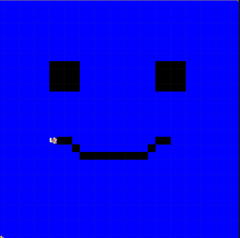

# Unit 1 - Asphalt Art

## Introduction

Cities use asphalt art to improve public safety, inspire their residents and visitors, and brighten communities. Your goal is to create asphalt art to revitalize The Neighborhood and bring the community together with the help of the Painter.

## Requirements

Use your knowledge of object-oriented programming, algorithms, the problem solving process, and decomposition strategies to create asphalt art:
- **Create a new subclass** – Create at least one new subclass of the PainterPlus class that is used for a component of the asphalt art design.
- **Plan an algorithm** – Use the problem solving process and decomposition strategies to plan an algorithm that incorporates a combination of sequencing, selection, and/or iteration.
- **Write a method** – Write at least one method in a PainterPlus subclass that contributes to a component of the asphalt art design.
- **Document your code** – Use comments to explain the purpose of the methods and code segments.

## Notes: Neighborhood & Painter Class

This project was created on Code.org's JavaLab platform using the built-in Neighborhood GUI output. To test and edit this project you must build in Code.org's JavaLab with the Neighborhood GUI enabled. For reference to the Painter class documentation, [you can read more here.](https://studio.code.org/docs/ide/javalab/classes/Painter)

## Output:

## Reflection

1. Describe your project.

   - I created a pixel art image using only JavaCode on code.org to make a picture of a smiley face with a blue background behind it. I used methods, selection statements, and used inheritance to make my code to run efficentely and to the best of its ability. 
2. What are two things about your project that you are proud of?

   - Two things that I am proud about my project is that i was successful to compelete an entire JavaCode on my own and have it run successfully. Another thing would be being able to correclty use selection statements since it is something that I just learned and am still trying to figure out how to use it to its best ability. 

3. Describe something you would improve or do differently if you had an opportunity to change something about your project.

   - Something i could improve on or do differently if I had an opportunity to change somethign about this project is that I would make my code more precise by using more selection statements or using print statements to debug the program. 
